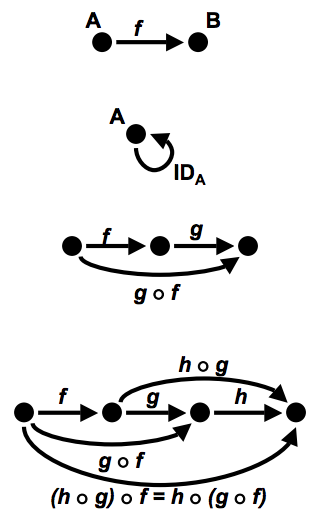

# Promise 慢速入门

Jingwei "John" Liu (刘敬威), [@th507](https://twitter.com/th507), Meituan.com
<br><a href="http://upload.wikimedia.org/wikipedia/commons/0/06/Nanyang_Walk_slow_lettering_20060317.JPG">Image</a> (CC BY-NC 3.0 US)

---
## 咦？不是讲函数式编程吗？

今天讲的是**用函数式的思维去思考 (think functionally)**

我们也会用函数式的方式来理解一下 Promise 到底是什么

---
# OOP/面相对象编程
- Object Oriented Programming/面相对象编程
- 像现实世界的一张快照，描述了那一瞬间内，各个组成部分之间的关系。

---

# 函数式编程, Why?
- 不同的编程模式、设计模式代表了对现实世界不同的抽象方式
- 问题的规模和形态决定了我们需要的抽象方式也是不同的
---
# Has-a, Is-a: OOP 描述的优势和局限
.left-column[
* 侧重于主语/名词
* 适合描述紧密耦合的模块内部
* 提供公开/私有的变量和方法
* 接口即实现

**Alice** is an employee.
```
	alice = new Employee();
```
**Employee** is a person.
```
	class Employee extends Person
```
**Alice** is 23.
```
	alice.age = 23;
```

]

.right-column[


怎么用 is-a/has-a 描述互相的好友关系
]

---

# 新词汇
类型论、域理论、函数式编程、范畴论...

为什么要研究这些

---

# 例子
Stream 流式处理
Gulp, Browserify, ...

---

# 当我们在说 FP 的时候我们在说什么
### Pattern matching
更自然的代码形式

### Immutability
减少副作用，减少赋值

### Morphism
研究更泛化的变换过程

---
# Pattern Matching 模式匹配
Pattern Matching is a dispatch mechanism: choosing which variant of a function is the correct one to call. Inspired by standard mathematical notations.

---
# Immutable 不可变的数据
为什么？
赋值

---
# Morphism 态射

---

# Down the rabbit hole：类型, 态射, 范畴
- 看数学书像是在看没有注释的代码，定义太多，解释太少。
- 今天尽可能讲一点定义，举一点例子
- 学习思维方式，不是具体技巧
- 有一些概念和理论和编程的问题是同构的，触类旁通

---
# Category Theory: 范畴论，不是犯愁论
**模块化**

- 把工作分为小块
- 分解实现
- 关注点分离

---

# 范畴
.left-column[
**我们定义范畴如下:**
- 一个类 $\mathcal{C}$，其元素称为 object
- 一个类 $hom(\mathcal{C})$，其元素称为态射 (morphism)。每个态射 $f$ 将一个源元素 (domain) $a$ 映射为一个目标元素 (codomain) $b$，其中 $a,b \in \mathcal{C}$，我们称 $f$ 为从 $a$ 到 $b$ 的态射，记为 $f : a \to b$。

	所有 $a$ 到 $b$ 的态射组成的类称为“态射集”，记为 $hom(a, b)$ 或 $C(a, b)$。

- 存在一个单位态射 (identity morphism)，使得对 $\forall x \in \mathcal{C}$ 有 $1_c: x \to x$。
]
.right-column[

]

---

# 想想看
范畴包含一个类，一个态射，一个二元运算。

[[Promise]] 类上的单位态射是什么？

定义：单位态射 (identity morphism)，使得对 $\forall x \in \mathcal{C}$ 有 $1_c: x \to x$。

显而易见的一个单位态射是 
```
f(x) -> x
```

还有一个非平凡的单位态射是 
```
f(x) -> Promise.resolve(x)
```

其实可以这样判断一个变量是否属于 [[Promise]] 类
```
function isPromise(p) {
	return p === Promise.resolve(p);
}
```

---

# 范畴 (cont)

- 一个二元运算，对 $\forall a,b,c \in \mathcal{C}$，若 $f:a \to b,g:b \to c$, 则 $g \circ f:a \to b$，则称为态射复合 (composition of morphism)，并满足以下两条公理：

	**单位元/零对象 (identity)**

	$\forall f:A \to B$, 我们有 $ f \circ 1_C = f$ 以及 $1_C \circ f = f$
	
	**结合律 (associativity)**

	$\forall f:a \to b, g:b \to c, h: c \to d$, 我们有 $ (h \circ g) \circ f = h \circ (g \circ f)$

---
# 例子
**连接字符串**

`([[Strings]],"",+)`

$\mathcal{C}$ 是字符串集合。态射集 $hom( \mathcal{C} )$ 为每个字符串自身，定义二元运算 $+$ 为字符串拼接

显然满足结合律，其单位元为空字符串。

**Promise.race** 的结合率

```
Promise.race([a, Promise.race([b, c])]
Promise.race([Promise.race([a, b]), c]) 
```

**其他**

`([[Integer]],0,+)`

`([[Integer]],1,*)`

---

# 半群与幺半群
**半群 (semigroup)**
集合 $\mathcal{S}$ 和其上的二元运算 $\mathcal{S} \times \mathcal{S} \to \mathcal{S}$ 满足结合率

$ \forall a,b,c \in \mathcal{S} $ 有 $(a \circ b) \circ c = a \circ (b \circ c)$


**Monoid (幺半群)**

具有单位元素的半群


---

# 范畴、半群、幺半群、群
Monoid (幺半群) 是具有单位元素的半群 (semigroup)

对比

 | 封闭性 | 结合律 | 单位元 | 逆元
-- | -- | -- | -- | --
范畴 | no | yes | yes | no
半群 | yes | yes | no | no
幺半群 | yes | yes | yes | no
群 | yes | yes | yes | yes


---
# 形而上学
- 为什么要研究群和集合
- 类型
---

# Functor 函子
- 是范畴之间的态射+映射
- 可用于描述范畴之间的关系

若 $\mathcal{C}$ 和 $\mathcal{D}$ 为范畴，定义**共变函子**（covariant functor) $F:\mathcal{C} \to \mathcal{D}$，由一个映射函数和一个态射组成。其中
- 映射函数是 $\mathcal{C}$ 的 total function
- 态射为 $\forall f: a \to b, a,b \in \mathcal{C}$

满足

- $ F 1_c = 1_F, c \in \mathcal{C} $
- $\forall f:a \to b, g: b\to c, a,b,c \in \mathcal{C}$,有 $F(g \circ f) = F(f) \circ F(g)$

---
# FP 中的函子

在 FP 里面，Functor 大致可以这么描述：可以被 map over 的类型

Haskell 中是这么定义的
```
class Functor f where 
	fmap :: (a -> b) -> f a -> f b
```

接受一个函数，这个函数从一个类型映射到另一个类型，还接受一个 functor 装有原始的类型，然后会回传一个 functor 装有映射后的类型。

---
# 例子
数组的 map, filter 都是 (自) 函子

Promise.all 是函子，但不是自函子

函数的结合

---

# 例子
比如我们希望把哈希表里面每个值都乘与 2
可以定义一个映射函数

```
function double(x) { return x;}
```

定义一个**函子**
```
map = function(fn) {
	return function(obj) {
		var newObj = {};
		for (var i in obj) {
			newObj[i] = fn(obj[i]);
		}
		return newObj;
	};
}
```

然后就可以
```
doubleObject = map(double);
doubleObject({a:1, b:2}); // => {a:2, b:4}
```
---

# Endofunctor 自函子

- 函子是范畴之间的关系 $F: \mathcal{C} \to \mathcal{D}$
- 子函子作用在同一个范畴上 $F: \mathcal{C} \to \mathcal{C}$

---
# 例子
```
function add(n) {
	return function(a) {
		return a + n;
	};
}

function map(fn) {
	return function(arr) {
		return arr.map(fn);
	}
}

map(add(10))([1,2]) // => 11,12
```


---

# Monad 单子
monad 可以简单的理解为一个范畴上的三元组 $(T, \eta, \mu)$ , 满足：

$T$ 是一个 $\mathcal{C}$ 上的自函子

$\eta$ 是单位元

$\mu$ 是一个 bind $M a \to (a \to M b) \to M b$

---
# Haskell 中的单子
- 一种数据结构
- 用于流式操作

---


# 温故知新


---

# ???

---

# 回头看看 Promise
- identity element: `Promise.resolve`

		var a = new Promise(...);
		var b = Promise.resolve(a);
		console.assert(a === b); // true


---

# Promise: 能用来做什么
- 传递不可变的数据
- 异步回调管理只是**副作用**：对赋值的封装
- 给定一个函数，返回一个 resolve/reject 后的数据结构，一定程度上实现了 pure function


---

# monoid 结合律的使用

<br clear>
<div left red>jQuery</div><div left blue>HighCharts</div><div left yellow>data-1</div><div left green>data-2</div><div left purple>data-3</div><div right>Draw</div>
<div clear></div>

---
# Code
```javascript
	// pseudocode

	getScript("jQuery", function() {
		getScript("HighChart", function() {
			getData("data-1", function() {
				getData("data-2", function() {
					getData("data-3", function() {
						drawChart(...)
					})
				})
			})
		})
	})
```

---
# 初级用户: Promise 减少了回调的缩进 
```javascript
	// pseudocode
	promise = new Promise(getScript("jQuery"))
	.then(getScript("HighChart"))
	.then(getData("data-1"))
	.then(getData("data-2"))
	.then(getData("data-3"))
	.then(drawChart)
```
---

# 再看看我们想做的事

<br clear>

<div left red>jQuery</div><div left blue>HighCharts</div><div left yellow>data-1</div><div left green>data-2</div><div left purple>data-3</div><div right>Draw</div>
<div clear></div>

* 数据获取不依赖HightChart.js
* 每个数据的获取互相没有依赖


---
# 试着使用结合率

```javascript
	//pseudocode
	promise = new Promise(getScript("jQuery"))
	.then(function() {
		return Promise
		.all(
			["data-1", "data-2", "data-3"].map(getData)
			.concat(getScript("HighChart"))
		)
	})
	.then(drawCharts)
```

**Before**

<div left red>jQuery</div><div left blue>HighCharts</div><div left yellow>data-1</div><div left green>data-2</div><div left purple>data-3</div><div right>Draw</div>
<div clear></div>

**After**

<div left red>jQuery</div><div left blue>HighCharts</div><div right>Draw</div>
<div clear></div>
<div left>jQuery</div><div left yellow>data-1</div>
<div clear></div>
<div left>jQuery</div><div left green>data-2</div>
<div clear></div>
<div left>jQuery</div><div left purple>data-3</div>

---
# Iterator: 泛化的遍历
```
Object.prototype[Symbol.iterator] = function() {
	return Object.keys(this).map(function(i) {
		return this[i];
	}, this)[Symbol.iterator]();
};

var a = {a:1,b:2}; 
for (let value of a) {
	console.log(value);
}
```

这和for in实现的功能都是一样的？

Iteractor 是对**可遍历**这个属性的一个抽象和归纳。取决于问题的复杂度，你可以选择不同抽象程度的方法来解决。

---
# 泛化的遍历: 例子

我们可以不需要数组的长度，我们只需要指定 `next()` 元素生成的机制来实现遍历。
```
function* powersOf2() {
  var i = 2;
  yield i;
  while (true) yield i *= i;
}

for (var i of powersOf2()) {
  console.log(i);
  if (i > 10000) break;
}
```

通过加上 `[Symbol.iterator]` 方法，我们实现二叉树和其他数据结构的遍历。
```
  HTMLCollection.prototype[Symbol.iterator] 
= NodeList.prototype[Symbol.iterator] 
= Array.prototype[Symbol.iterator];

for (var element of document.getElementByTagName("*")) {
	console.log(element);
} 
```
---
# 学习函数式编程...
- 改变思维的方式
- 锻炼在更高层次上思考、抽象的能力
- 并不是每个地方都适合用 FP，结合紧密的模块内部用 OOP 就很好
- 了解实现细节并不代表你可以了解这个东西的意义和用途  

---
# 设计模式/编程语言 Deprecated

> 學會了開發工具的操作與程式語言，像是學會了如何使用搖桿上每個按鈕的功能，你學會某個函式如何使用，就像是學會了某個招式。

> 接下來，你發現將某些招式組合起來，可以發揮更大的威力，像是，如果你玩格鬥天王系列，就知道如果讓草薙京把對手踢到空中的時候，就可以施展大蛇薙，這，我們稱之為連續技；如果你平常就熟練這些連續技，又清楚出招的時機，經常可以有效傷害對方，取得不錯的成績。

> Design Pattern 就是這些年來許多軟體工程師所整理出來，在遇到某些類似的時機可以用上，而且提供了一套現成的詞彙，方便你說明你做了什麼，或是打算怎麼做某個東西。

> 有人問我會不會注重、應不應該注重 Design Pattern，這個問題實在有點奇妙…我還沒有看過多少人玩格鬥電玩不練連續技，但也沒有看到有人每次在對戰中，都非要把某套連續技施展出來不可。

> [@zonble](http://zonble.net/archives/2014_04/1607.php)

---

# Thanks
- [Functors, Applicatives, And Monads In Pictures](http://adit.io/posts/2013-04-17-functors,_applicatives,_and_monads_in_pictures.html)
- [A Fistful of Monads](http://learnyouahaskell.com/a-fistful-of-monads)
- [The Iterator protocol](https://developer.mozilla.org/en-US/docs/Web/JavaScript/Guide/The_Iterator_protocol)
- 现代应用数学手册: 离散数学卷
- Categories for the Working Mathematician


## Disclaimer
今天讲的内容里面，有一些是数学或是编程中的概念，有一些是我自己理解和解读。

我只算一个数学门外汉，虽说我已尽力检查相关的资料，但若有错误之处，无论是概念方面还是理解方面的错误，还请大家多多指正。


---
DEPRECATED

---


# Functional Programming: 好还是坏？  @high
- focus on the *verb*
- 更高层次的抽象
- 态射(morphism)：研究更泛化的变换过程
- 提供的是一种规范，而不是具体实现。比如 Iterator (可遍历)
- 变换与同构，系统性的类比和推演
- 减少副作用，减少赋值

---
# 例子
### array iteration
- for loop
		for (var i = 0; i < arr.length; i++) { ... }
	用到了数组的length，不够通用。比如对象的遍历怎么办？
	
- forEach
		arr.forEach(function(item) {...})

- 在线数据怎么办？

	Iterator (稍后再讲)

---
# 对 Promise 的常见认识
1. 没啥用啊
2. 用起来要要改现有代码
3. 这是用来管理异步调用的工具
4. Promise 太好用了！我用它管理所有的队列

#### 我来说
[[Promise]] 代表了一个数据类型，`then` 是一个幺半群上的自函子。

---

